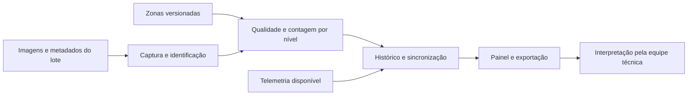

# Proposta de solução

Propomos desenvolver uma ferramenta para analisar imagens e acompanhar a **distribuição das aves visíveis entre os níveis do Jump Start durante uma parte definida da recria**. Jump Start é o nome de um sistema de recria da Vencomatic. Ele tem linhas para oferecer ração e água e plataformas ajustáveis. Durante o crescimento, as aves aprendem a se deslocar entre os níveis e a usar os poleiros. **Aviário** é o galpão onde ficam as aves; **Jump Start** é o sistema instalado dentro dele. A descrição do sistema baseia-se na [página do fabricante](https://www.vencomaticgroup.com/layers/jump-start).

A análise de imagens por computador é chamada **visão computacional**. Neste projeto, ela serve para identificar e contar aves que aparecem nas imagens, não para enxergar o aviário inteiro. O [glossário](./glossario.md) explica essa e outras expressões usadas nas páginas. A solução deverá guardar as contagens e os percentuais por nível para que a equipe técnica possa consultar a evolução por câmera, horário e idade do lote.

O primeiro **protótipo funcional**, também chamado de produto mínimo viável (MVP), deverá demonstrar que essa medição é possível e útil com imagens reais da Raiar. A decisão sobre o manejo continuará com a equipe responsável. Antes de desenvolver a contagem, o grupo precisa confirmar a idade das aves, quais níveis serão observados e se as imagens permitem distingui-los.

:::caution Escopo em validação
O TAP e o roteiro original de artefatos tratam de ovos de cama na produção. O documento de redirecionamento propõe avaliar a recria, e a primeira versão dos requisitos do Yan já segue esse recorte. Esta proposta adota a recria como hipótese de trabalho, sem registrar como concluída uma aprovação formal que não consta nas fontes consultadas. O alinhamento do TAP, do roteiro de avaliação e do cronograma deve ser confirmado pela equipe com o parceiro.
:::

## Problema e evidências disponíveis

Segundo a proposta de redirecionamento da Raiar, o acompanhamento da utilização dos níveis da recria é predominantemente visual, e existe interesse em transformá-lo em um histórico quantitativo [E1, seções 4 e 5]. Ainda precisamos observar na visita como esse acompanhamento ocorre, quais registros já existem e quais decisões seriam apoiadas por uma nova medição.

| ID | Evidência e origem | Implicação para a proposta | Limite |
| --- | --- | --- | --- |
| E1 | Documento interno de redirecionamento, seções 3 a 5: pergunta sobre a ocupação dos níveis e sugestão de MVP delimitado | Priorizar contagem e distribuição por nível ao longo do tempo | É uma proposta para avaliação, não uma comprovação de viabilidade |
| E2 | Mesmo documento, seção 7: relato de câmeras em três aviários de recria e um de produção | Avaliar reaproveitamento das imagens existentes | Quantidade de câmeras, resolução, acesso e enquadramento não estão confirmados |
| E3 | Primeira versão dos requisitos, RF03, RF06 a RF09: zonas configuradas, aves visíveis, histórico e exportação | Preservar a câmera e a versão das zonas em cada resultado | Requisitos em PR aberto na consulta, sujeitos a revisão |
| E4 | TAP, seções 7, 10, 11 e 15: restrição de recursos e MVP em ambiente simulado | Validar primeiro com arquivos reais do parceiro e processamento em laboratório | Instalação permanente na Raiar não integra automaticamente esta entrega |
| E5 | Roteiro de artefatos, Sprint 1: proposta com funcionalidades, escopo, hipóteses, indicadores e plano de dados | Documentar a proposta junto ao dicionário e ao pedido de dados | Roteiro ainda descreve o escopo original e precisa de alinhamento |

Os relatos sobre aviários europeus presentes em E1 são contexto fornecido pelo parceiro. A pesquisa do Cauê deverá verificar referências e condições de aplicação; esta proposta não os transforma em padrões universais de comportamento ou metas para o modelo.

## Público e valor esperado

A equipe zootécnica e a gestão são os públicos propostos para consultar o histórico. O operador técnico deverá configurar a coleta, conferir enquadramentos e acompanhar falhas. Esses papéis são provisórios e devem ser refinados nas personas e na jornada do Will.

| Necessidade a validar | Funcionalidade proposta | Valor esperado | Evidência necessária |
| --- | --- | --- | --- |
| Comparar a ocupação dos níveis em momentos diferentes | Contagem e percentual por nível, câmera, data e idade | Tornar a observação consultável ao longo do tempo | Imagens anotáveis e avaliação de utilidade pela equipe técnica |
| Entender o que foi efetivamente observado | Imagem de referência, zonas e indicador de qualidade | Evitar interpretar falha de captura como ausência de aves | Concordância sobre níveis visíveis e cenas avaliáveis |
| Recuperar resultados para análise | Histórico filtrável e exportação CSV | Facilitar a análise do mesmo lote | Usuário localizar um período e interpretar o resultado corretamente |
| Identificar interrupções na coleta | Estado dos dispositivos, lacunas e registros de falha | Explicitar os limites do histórico | Testes de desconexão, captura e processamento |

Essas relações são insumos para o Canvas de Proposta de Valor do Gui. Ganhos de produtividade, redução de ovos de cama e benefícios econômicos não foram medidos e não são resultados prometidos pelo MVP.

## Alternativas consideradas

| Alternativa | Resultado possível | Esforço e dependências | Limitação para este momento |
| --- | --- | --- | --- |
| Manter a observação atual | Continuidade da rotina, a caracterizar na visita | Tempo da equipe e registros já disponíveis | Ainda não sabemos se existe histórico suficiente para responder à pergunta |
| Registrar manualmente uma amostra de imagens | Referência de contagem e teste da utilidade dos indicadores | Acesso às imagens e tempo de anotação | Volume limitado pela disponibilidade dos anotadores |
| Automatizar a medição na recria, opção proposta | Histórico de distribuição por nível e câmera | Imagens adequadas, zonas, anotações e processamento viável | Oclusão e enquadramento podem inviabilizar a distinção dos níveis |
| Manter o projeto original de ovos de cama | Entrega alinhada ao TAP original | Dataset e validações próprios para ovos de cama | Responde a outra pergunta; a decisão depende do alinhamento acadêmico e com o parceiro |

A recomendação é começar pela anotação manual de uma pequena amostra da recria e avançar para automação se os níveis forem distinguíveis. Se essa condição falhar, a equipe deverá avaliar outro enquadramento ou retomar o escopo original com o parceiro. Um protótipo de painel, sozinho, não comprova a viabilidade da medição.

## Escopo do MVP

O recorte inicial proposto é **um lote, um aviário e um campo de visão fixo**, com os níveis observáveis e a janela de idade definidos com a Raiar. A quantidade de dispositivos prevista nos requisitos é uma meta de capacidade a testar separadamente, não evidência de cobertura de três aviários.

### Funcionalidades incluídas

1. Identificar lote, aviário, câmera e instalação utilizada; configurar as zonas correspondentes aos níveis visíveis.
2. Receber imagens reais ou amostrar quadros em janelas definidas, preservando origem, horário e configuração.
3. Processar os quadros e estimar a quantidade de aves visíveis por nível, identificando cenas inadequadas e aves sem nível atribuível.
4. Calcular percentuais, armazenar resultados e versões e apresentar a evolução do mesmo lote por câmera.
5. Oferecer filtros, imagens representativas autorizadas, exportação CSV e indicação de lacunas ou falhas.
6. Associar telemetria ambiental ao período quando disponível e validada. A comparação temporal não demonstrará causalidade.
7. Controlar acesso e aplicar a retenção acordada para cada categoria de dado.

### Fora do MVP inicial

Identificação individual de aves; contagem do lote inteiro a partir de uma câmera; soma de câmeras com sobreposição; rastreamento de saltos e trajetórias; classificação automática de comportamento adequado; diagnóstico sanitário; recomendações de manejo; alertas de amontoamento; predição de desempenho; detecção de ovos de cama; integração com sistemas corporativos; instalação permanente em campo.

Comparação entre lotes, padrões esperados por idade e relação entre recria e produção são evoluções possíveis [E1, seções 6 e 10]. Exigem outro desenho de dados e validação. O MVP não emitirá conclusão sobre certificação ou bem-estar a partir da distribuição observada.

## Módulos e fluxo proposto

O módulo de captura associa cada quadro à instalação e ao lote corretos. O processamento proposto ocorre no dispositivo local, conforme RF05 da versão inicial dos requisitos, com armazenamento temporário e sincronização posterior. A escolha definitiva do hardware e da frequência dependerá dos ensaios de capacidade. A plataforma concentra consulta, histórico e exportação.

O [dicionário de dados](./dicionario-de-dados.md) define o significado de cada registro. Sua unidade básica de medição é **um quadro, uma câmera, uma versão de zonas e um nível**. Percentuais descrevem a distribuição das detecções com nível atribuível; aves sem atribuição aparecem separadamente. Não representam o percentual de todas as aves alojadas.

## Hipóteses, critérios e métricas

Os IDs abaixo conectam problema, oportunidade, decisão, dados e validação. As referências RF/RNF apontam para E3 e deverão acompanhar eventuais mudanças feitas pelo Yan.

| Hipótese e oportunidade | Decisão e requisito relacionado | Dados necessários | Critério de aceite proposto e métrica |
| --- | --- | --- | --- |
| H1: níveis e aves são distinguíveis nas imagens; oportunidade de medir ocupação | Testar zonas e contagem, RF03 e RF06, RNF08 | Imagens, zonas e contagens de referência | Dois anotadores conseguem aplicar o protocolo; reportar fração avaliável, divergência e erro por nível antes de fixar a meta |
| H2: o histórico facilita comparar períodos; oportunidade de apoiar análise | Painel por lote, idade e câmera, RF07 a RF09 | Resultados, datas e idade de referência | Usuário seleciona dois períodos, identifica o nível predominante e reconhece uma lacuna; registrar acertos, tempo e feedback |
| H3: a coleta é viável no dispositivo; oportunidade de manter continuidade | Processamento local e reenvio, RF04 e RF05, RNF01, RNF03 e RNF04 | Configuração, fila e registros de sincronização | Testar as metas preliminares de 24 h sem rede e três dispositivos; medir perdas, duplicações, fila e tempo de recuperação |
| H4: cada resultado pode ser explicado; oportunidade de revisar erros | Preservar origem e versões, RF07, RF09 e RNF10 | Quadro, zonas, modelo e status de qualidade | Todo resultado de teste remete às versões utilizadas; imagem só é recuperável dentro de sua retenção |

Para medir H1, usar um conjunto de teste anotado e separado do treino por sessão de captura. Reportar erro absoluto médio de contagem em aves, erro percentual agregado de contagem e diferença absoluta de distribuição em pontos percentuais, conforme as fórmulas do dicionário. As metas de **15% de erro de contagem e 10 pontos percentuais por nível** vêm do RNF08 preliminar; dependem da concordância sobre a fórmula, da qualidade das imagens e da aprovação conjunta antes da avaliação final. Não são resultados já alcançados.

O comparador inicial será a contagem manual, com uma amostra revisada por dois anotadores. O tempo atual de análise e a existência de registros operacionais serão levantados na visita para estabelecer uma linha de base. Benefício operacional será avaliado com usuários; desempenho do modelo será avaliado com rótulos, sem confundir as duas medidas.

## Viabilidade, riscos e condições de revisão

| Risco | Efeito | Resposta e condição para avançar |
| --- | --- | --- |
| Níveis sobrepostos na imagem ou aves ocultas | Contagem enviesada e atribuição ambígua | Inspeção com o parceiro; ajustar campo de visão ou reduzir zonas; não extrapolar para aves ocultas |
| Poucas idades, dias ou condições de luz | Histórico pouco representativo | Matriz de cobertura e pedido de novas amostras; declarar o recorte avaliado |
| Mudança de câmera ou estrutura | Quebra da comparação temporal | Nova instalação ou versão de zonas e marcação da mudança no histórico |
| Imagens atrasadas ou acesso indisponível | Atraso do modelo e da validação | Pactuar responsáveis e entregas; usar dados sintéticos apenas para testar o fluxo |
| Hardware e armazenamento insuficientes | Fila crescente ou descarte de quadros | Medir custo por quadro e volume diário antes de definir frequência e retenção |
| Falta de aprovação do redirecionamento | Entrega incompatível com avaliação ou expectativa | Confirmar escopo com equipe, parceiro e responsáveis acadêmicos antes da implementação |

Não há orçamento aprovado nem inventário confirmado nesta versão. Para dimensionar o protótipo, Carlos Ícaro consolidará com a equipe: quantidade de dispositivos disponíveis, armazenamento, conectividade, horas de anotação, desenvolvimento e manutenção. O custo será estimado como soma de equipamentos, instalação, armazenamento, operação e horas de trabalho, distinguindo recursos já disponíveis de novas aquisições. Sem essas entradas, não há total financeiro ou economia defensável. A análise financeira detalhada permanece na etapa prevista pelo roteiro de artefatos [E5].

## Próximas validações e responsabilidades

| Entrega ou decisão | Responsável na Sprint 1 | Próximo sinal esperado |
| --- | --- | --- |
| Consolidar proposta e pedido de dados | Carlos Ícaro | Escopo e pacote inicial revisados com a equipe |
| Relacionar dores e ganhos no Canvas | Gui | Vínculo entre necessidades confirmadas e proposta |
| Confirmar públicos, rotina e jornada | Will | Evidência de quem configura, consulta e decide |
| Alinhar requisitos e metas de qualidade | Yan | Critérios coerentes com os dados disponíveis |
| Investigar referências europeias | Cauê | Fontes e limites de transferência para a Raiar |
| Formular perguntas e realizar a visita | Grupo todo | Registro das respostas, pendências, responsáveis e prazos |
| Validar recorte e autorizar uso das imagens | Raiar e equipe do projeto | Lote, idade, níveis, acesso e uso definidos |

Revisar esta proposta após a visita e a inspeção do primeiro pacote de imagens, antes de iniciar o treinamento. Se o Canvas ou a jornada apontarem outra necessidade prioritária, rever o MVP e o pedido de dados em conjunto.

## Fontes e estado de validação

Consulta ao material disponível em **24/09/2026**. Os documentos originais foram preservados na pasta `Arquivos` do repositório privado, no commit `4136a4e`. Os links abaixo fixam a versão consultada e permitem confrontar a síntese com o material; não substituem o registro de aprovação do parceiro.

- **E1 e E2:** [Proposta para avaliação de possível redirecionamento do projeto](https://github.com/AgroTech-Inteli-ATI/2026_02_Raiar/blob/4136a4ee882fc6b6619af90a4ee4cc7294403b6f/Arquivos/Proposta%20para%20avalia%C3%A7%C3%A3o%20de%20poss%C3%ADvel%20redirecionamento%20do%20projeto%20%282%29.docx), seções 3 a 10. A seção 8 apresenta explicitamente os cenários de mudança e de manutenção do projeto.
- **E3:** [Requisitos, versão 0aa9a71](https://github.com/AgroTech-Inteli-ATI/2026_02_Raiar/blob/0aa9a7107628c61197a883bf3c6f236193f99c7e/DOCUMENTACAO_REQUISITOS.md), vinculada ao [PR #1](https://github.com/AgroTech-Inteli-ATI/2026_02_Raiar/pull/1). A referência fixa a versão consultada, sem antecipar sua aprovação.
- **E4:** [TAP AgroTech Raiar Orgânicos](https://github.com/AgroTech-Inteli-ATI/2026_02_Raiar/blob/4136a4ee882fc6b6619af90a4ee4cc7294403b6f/Arquivos/TAP_AgroTech_Raiar_Organicos.pdf), seções 7, 10, 11 e 15, páginas 3, 6, 8 e 9.
- **E5:** [Artefatos Raiar](https://github.com/AgroTech-Inteli-ATI/2026_02_Raiar/blob/4136a4ee882fc6b6619af90a4ee4cc7294403b6f/Arquivos/artefatos%20raiar1.pdf), Sprint 1, página 1, e análise financeira da Sprint 3, página 3.
- **Responsabilidades:** divisão de tarefas da Sprint 1 informada por Carlos Ícaro.
