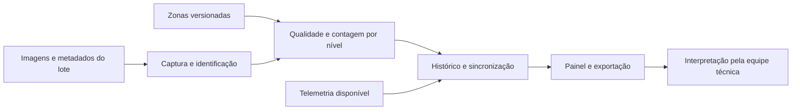

# Proposta de solução

A solução proposta consiste em analisar imagens para acompanhar a **distribuição das aves visíveis entre os níveis do Jump Start durante uma parte definida da recria**. Jump Start é o nome de um sistema de recria da Vencomatic. Ele tem linhas para oferecer ração e água e plataformas ajustáveis. Durante o crescimento, as aves aprendem a se deslocar entre os níveis e a usar os poleiros. **Aviário** é o galpão onde ficam as aves; **Jump Start** é o sistema instalado dentro dele. A descrição do sistema baseia-se na [página do fabricante](https://www.vencomaticgroup.com/layers/jump-start).

A análise de imagens por computador é chamada **visão computacional**. Neste projeto, ela serve para identificar e contar aves que aparecem nas imagens, não para enxergar o aviário inteiro. O [glossário](./glossario.md) explica essa e outras expressões usadas nas páginas. A solução deverá guardar as contagens e os percentuais por nível para que a equipe técnica possa consultar a evolução por câmera, horário e idade do lote.

O primeiro **protótipo funcional**, também chamado de produto mínimo viável (MVP), deverá demonstrar que essa medição é possível e útil com imagens reais da Raiar. A decisão sobre o manejo continuará com a equipe responsável. Antes de desenvolver a contagem, o grupo precisa confirmar a idade das aves, quais níveis serão observados e se as imagens permitem distingui-los.

## Público e valor esperado

A equipe zootécnica e a gestão poderão consultar a distribuição das aves visíveis por nível, câmera e período para acompanhar a evolução do lote. O operador técnico deverá configurar a coleta e verificar a qualidade das imagens e eventuais falhas. O valor esperado é um histórico que permita comparar períodos; sua utilidade para decisões de manejo será avaliada com os usuários.

## Alternativas consideradas

A ocupação dos níveis pode continuar a ser observada diretamente ou registrada por contagem manual de uma amostra de imagens. A contagem manual servirá de referência para avaliar a medição automática. A automação poderá produzir um histórico por nível e horário se as imagens permitirem distinguir as aves e os níveis; caso contrário, será necessário ajustar o enquadramento da câmera ou reduzir a área analisada.

## Escopo do MVP

O recorte inicial proposto é **um lote, um aviário e um campo de visão fixo**, com os níveis observáveis e a janela de idade definidos com a Raiar. A quantidade de dispositivos prevista nos [requisitos](./requisitos.md) é uma meta de capacidade a testar separadamente, não evidência de cobertura de três aviários.

### Funcionalidades incluídas

1. Identificar lote, aviário, câmera e instalação utilizada; configurar as zonas correspondentes aos níveis visíveis.
2. Receber imagens reais ou amostrar quadros em janelas definidas, preservando origem, horário e configuração.
3. Processar os quadros e estimar a quantidade de aves visíveis por nível, identificando cenas inadequadas e aves sem nível atribuível.
4. Calcular percentuais, armazenar resultados e versões e apresentar a evolução do mesmo lote por câmera.
5. Oferecer filtros, imagens representativas autorizadas, exportação CSV e indicação de lacunas ou falhas.
6. Associar telemetria ambiental ao período quando disponível e validada. A comparação temporal não demonstrará causalidade.
7. Controlar acesso e aplicar a retenção acordada para cada categoria de dado.

### Fora do MVP inicial

Identificação individual de aves; contagem do lote inteiro a partir de uma câmera; soma de câmeras com sobreposição; rastreamento de saltos e trajetórias; classificação automática de comportamento adequado; diagnóstico sanitário; recomendações de manejo; alertas de amontoamento; predição de desempenho; detecção de ovos de cama; integração com sistemas corporativos; instalação permanente em campo.

Comparação entre lotes, padrões esperados por idade e relação entre recria e produção são evoluções possíveis, descritas na [proposta da Raiar](https://github.com/AgroTech-Inteli-ATI/2026_02_Raiar/blob/4136a4ee882fc6b6619af90a4ee4cc7294403b6f/Arquivos/Proposta%20para%20avalia%C3%A7%C3%A3o%20de%20poss%C3%ADvel%20redirecionamento%20do%20projeto%20%282%29.docx). Exigem outro desenho de dados e validação. O MVP não emitirá conclusão sobre certificação ou bem-estar a partir da distribuição observada.

## Módulos e fluxo proposto

O módulo de captura associa cada quadro à instalação e ao lote corretos. O processamento proposto ocorre no dispositivo local, conforme RF05 da versão inicial dos requisitos, com armazenamento temporário e sincronização posterior. A escolha definitiva do hardware e da frequência dependerá dos ensaios de capacidade. A plataforma concentra consulta, histórico e exportação.

O [dicionário de dados](./dicionario-de-dados.md) define o significado de cada registro. Sua unidade básica de medição é **um quadro, uma câmera, uma versão de zonas e um nível**. Percentuais descrevem a distribuição das detecções com nível atribuível; aves sem atribuição aparecem separadamente. Não representam o percentual de todas as aves alojadas.

## Hipóteses, critérios e métricas

Os IDs abaixo conectam problema, oportunidade, decisão, dados e validação. As referências RF/RNF apontam para os [requisitos](./requisitos.md), cuja versão inicial foi consultada no commit `0aa9a71` [2], e precisarão ser revistas caso essa documentação mude.

| Hipótese e oportunidade | Decisão e requisito relacionado | Dados necessários | Critério de aceite proposto e métrica |
| --- | --- | --- | --- |
| H1: níveis e aves são distinguíveis nas imagens; oportunidade de medir ocupação | Testar zonas e contagem, RF03 e RF06, RNF08 | Imagens, zonas e contagens de referência | Dois anotadores conseguem aplicar o protocolo; reportar fração avaliável, divergência e erro por nível antes de fixar a meta |
| H2: o histórico facilita comparar períodos; oportunidade de apoiar análise | Painel por lote, idade e câmera, RF07 a RF09 | Resultados, datas e idade de referência | Usuário seleciona dois períodos, identifica o nível predominante e reconhece uma lacuna; registrar acertos, tempo e feedback |
| H3: a coleta é viável no dispositivo; oportunidade de manter continuidade | Processamento local e reenvio, RF04 e RF05, RNF01, RNF03 e RNF04 | Configuração, fila e registros de sincronização | Testar as metas preliminares de 24 h sem rede e três dispositivos; medir perdas, duplicações, fila e tempo de recuperação |
| H4: cada resultado pode ser explicado; oportunidade de revisar erros | Preservar origem e versões, RF07, RF09 e RNF10 | Quadro, zonas, modelo e status de qualidade | Todo resultado de teste remete às versões utilizadas; imagem só é recuperável dentro de sua retenção |

Para medir H1, será necessário um conjunto de teste anotado e separado do treino por sessão de captura. A avaliação deverá apresentar erro absoluto médio de contagem em aves, erro percentual agregado de contagem e diferença absoluta de distribuição em pontos percentuais, conforme as fórmulas do dicionário. As metas de **15% de erro de contagem e 10 pontos percentuais por nível** vêm do RNF08 preliminar; dependem da concordância sobre a fórmula, da qualidade das imagens e da aprovação conjunta antes da avaliação final. Não são resultados já alcançados.

O comparador inicial será a contagem manual, com uma amostra revisada por dois anotadores. O tempo atual de análise e a existência de registros operacionais serão levantados na visita para estabelecer uma linha de base. Benefício operacional será avaliado com usuários; desempenho do modelo será avaliado com rótulos, sem confundir as duas medidas.

## Viabilidade, riscos e condições de revisão

| Risco | Efeito | Resposta e condição para avançar |
| --- | --- | --- |
| Níveis sobrepostos na imagem ou aves ocultas | Contagem enviesada e atribuição ambígua | Inspeção com o parceiro; ajustar campo de visão ou reduzir zonas; não extrapolar para aves ocultas |
| Poucas idades, dias ou condições de luz | Histórico pouco representativo | Matriz de cobertura e pedido de novas amostras; declarar o recorte avaliado |
| Mudança de câmera ou estrutura | Quebra da comparação temporal | Nova instalação ou versão de zonas e marcação da mudança no histórico |
| Imagens atrasadas ou acesso indisponível | Atraso do modelo e da validação | Pactuar responsáveis e entregas; usar dados sintéticos apenas para testar o fluxo |
| Hardware e armazenamento insuficientes | Fila crescente ou descarte de quadros | Medir custo por quadro e volume diário antes de definir frequência e retenção |

Não há orçamento aprovado nem inventário confirmado nesta versão. O dimensionamento do protótipo requer levantar quantidade de dispositivos disponíveis, armazenamento, conectividade e horas de anotação, desenvolvimento e manutenção. O custo deverá reunir equipamentos, instalação, armazenamento, operação e horas de trabalho, distinguindo recursos já disponíveis de novas aquisições. Sem essas entradas, não há total financeiro ou economia defensável. A análise financeira detalhada permanece na etapa prevista pelo [roteiro de artefatos](https://github.com/AgroTech-Inteli-ATI/2026_02_Raiar/blob/4136a4ee882fc6b6619af90a4ee4cc7294403b6f/Arquivos/artefatos%20raiar1.pdf).

## Próximas validações

| Frente | Próximo resultado a verificar |
| --- | --- |
| Proposta e pedido de dados | Escopo e pacote inicial revisados |
| [Canvas de Proposta de Valor](./canvas-proposta-de-valor.md) | Vínculo entre necessidades confirmadas e proposta |
| Personas e jornada | Evidência de quem configura, consulta e decide |
| Requisitos e metas de qualidade | Critérios coerentes com os dados disponíveis |
| Pesquisa sobre aviários europeus | Fontes e limites de transferência para a Raiar |
| Visita | Registro das respostas, pendências e prazos |
| Recorte e uso das imagens | Lote, idade, níveis, acesso e uso definidos com a Raiar |

A proposta deverá ser revista após a visita e a inspeção do primeiro pacote de imagens, antes do treinamento do modelo. Caso o Canvas ou a jornada indiquem outra necessidade prioritária, o recorte do MVP e o pedido de dados deverão ser reavaliados.

## Referências {#referencias}

[1] RAIAR ORGÂNICOS. **Proposta para avaliação de possível redirecionamento do projeto**. 2026. Documento interno, seções 3 a 10. Disponível em: https://github.com/AgroTech-Inteli-ATI/2026_02_Raiar/blob/4136a4ee882fc6b6619af90a4ee4cc7294403b6f/Arquivos/Proposta%20para%20avalia%C3%A7%C3%A3o%20de%20poss%C3%ADvel%20redirecionamento%20do%20projeto%20%282%29.docx. Acesso em: 24 set. 2026.

[2] AGROTECH INTELI. **Requisitos iniciais**. 2026. Versão do commit `0aa9a71`. Disponível em: https://github.com/AgroTech-Inteli-ATI/2026_02_Raiar/blob/0aa9a7107628c61197a883bf3c6f236193f99c7e/DOCUMENTACAO_REQUISITOS.md. Acesso em: 24 set. 2026.

[3] TAP AgroTech Raiar Orgânicos. 2026. Documento interno. Disponível em: https://github.com/AgroTech-Inteli-ATI/2026_02_Raiar/blob/4136a4ee882fc6b6619af90a4ee4cc7294403b6f/Arquivos/TAP_AgroTech_Raiar_Organicos.pdf. Acesso em: 24 set. 2026.

[4] ROTEIRO de artefatos: Raiar. 2026. Documento interno. Disponível em: https://github.com/AgroTech-Inteli-ATI/2026_02_Raiar/blob/4136a4ee882fc6b6619af90a4ee4cc7294403b6f/Arquivos/artefatos%20raiar1.pdf. Acesso em: 24 set. 2026.

Os documentos internos estão preservados no repositório privado do projeto.
